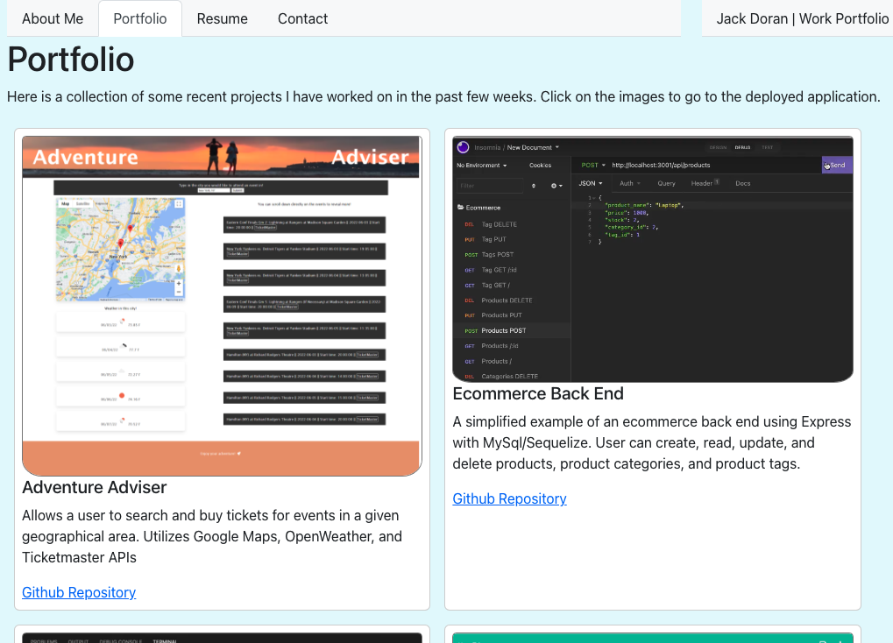

# My Portfolio (React version)

## Summary

This is a portfolio that houses example of some of my web development work and other projects. It was designed to be responsive to user interaction, and different screen sizes. This is an udate to a previous version that uses React to render the different pages. 

## Technologies and Packages Used

[React](https://reactjs.org/) was used to render the different pages and create and manage component elements. The package ```create-react-app``` was used to create a local instance of react. [Bootstrap](https://getbootstrap.com/) was used for styling and layouts.

## Deployed Portfolio Page

[Link to Deployed Portfolio Page on GH Pages](https://jcdoran33.github.io/my-portfolio-react/)

## Screenshot of Portfolio



## Contact

If you are interested in getting in touch, please email jcdoran33@gmail.com .